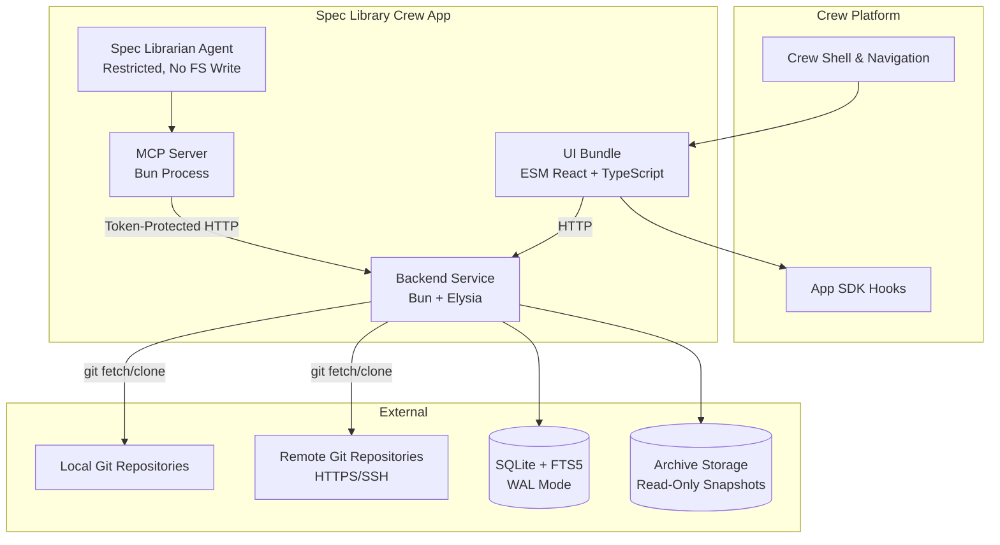
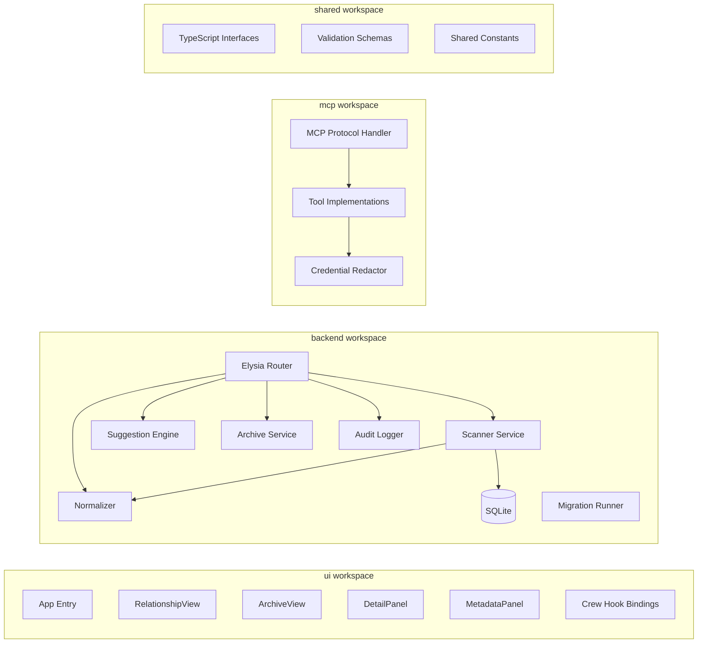

# Design Document: Spec Library Crew App

## Overview

The Kiro Spec Library is a full-stack Crew app that indexes, normalizes, and presents `.kiro/specs/` artifacts from local and remote Git repositories. It provides two primary views—a dark relationship-first graph canvas (Relationship View) and a light chronological archive table (Archive View)—backed by a SQLite database with FTS5 search, immutable archive snapshots, curated metadata overlays, deterministic relationship suggestions, and a restricted Spec Librarian AI agent.

The system runs on **Bun** as both the package manager and backend runtime, leveraging Bun's native TypeScript support, fast startup, and built-in `bun:sqlite` for zero-dependency database access. The UI is an ESM library bundle consumed by the Crew platform shell at runtime.

### Key Design Decisions

- **Bun runtime**: All backend and MCP processes run under Bun. Database uses `bun:sqlite` (zero-dependency, native binding). Bun workspaces replace npm workspaces.
- **Elysia framework**: Type-safe HTTP routing with built-in schema validation via TypeBox, eliminating separate validation layers for API requests/responses.
- **Single-writer SQLite**: One backend process owns the database. The MCP server communicates over a token-protected localhost HTTP endpoint.
- **Deterministic normalization**: Identical inputs always produce identical outputs for Spec keys, lifecycle stages, progress, and node positions.
- **Immutable snapshots**: Archive records are write-once with hash verification. Purge is manual, gated, and leaves tombstones.
- **No repository writes**: The app never modifies, commits to, or pushes source repositories.
- **Crew shell integration**: The app renders content only—no sidebar, top nav, or navigation chrome.

## Architecture

### System Context Diagram



### Component Architecture



### Workspace Structure

```
kiro-spec-library/
├── app.json                    # Crew manifest
├── bun.lockb                   # Bun lockfile
├── package.json                # Root workspace config
├── shared/
│   ├── package.json
│   └── src/
│       ├── types.ts            # All shared TypeScript interfaces
│       ├── schemas.ts          # Zod validation schemas (sidecar & config only)
│       ├── constants.ts        # Shared constants and enums
│       └── index.ts
├── backend/
│   ├── package.json
│   ├── dist/index.mjs          # Compiled bundle (committed)
│   └── src/
│       ├── index.ts            # Entry point, server setup
│       ├── router.ts           # Elysia route definitions with TypeBox schemas
│       ├── db/
│       │   ├── connection.ts   # bun:sqlite connection + WAL setup
│       │   ├── migrations/     # Numbered migration files
│       │   └── queries/        # Prepared statement modules
│       ├── services/
│       │   ├── scanner.ts      # Repository scanning
│       │   ├── normalizer.ts   # Spec normalization
│       │   ├── suggester.ts    # Relationship suggestion engine
│       │   ├── archiver.ts     # Snapshot creation/management
│       │   ├── metadata.ts     # Metadata resolution
│       │   └── audit.ts        # Audit event recording
│       └── security/
│           ├── path-validator.ts
│           ├── git-validator.ts
│           └── redactor.ts
├── ui/
│   ├── package.json
│   ├── dist/index.mjs          # Compiled bundle (committed)
│   └── src/
│       ├── index.tsx           # ESM library entry
│       ├── App.tsx
│       ├── views/
│       │   ├── RelationshipView.tsx
│       │   └── ArchiveView.tsx
│       ├── components/
│       │   ├── DetailPanel.tsx
│       │   ├── MetadataPanel.tsx
│       │   ├── GraphCanvas.tsx
│       │   ├── NodeComponent.tsx
│       │   ├── EdgeComponent.tsx
│       │   └── FilterBar.tsx
│       ├── hooks/
│       │   ├── useCrewIntegration.ts
│       │   ├── useUrlState.ts
│       │   └── useSpecData.ts
│       └── styles/
│           ├── tokens.ts       # Design tokens
│           └── global.css
├── mcp/
│   ├── package.json
│   ├── dist/index.mjs          # Compiled bundle (committed)
│   └── src/
│       ├── index.ts            # MCP server entry
│       ├── tools.ts            # Tool implementations
│       └── redactor.ts         # Credential redaction
└── tests/
    ├── unit/
    ├── integration/
    ├── property/
    └── e2e/
```

## Components and Interfaces

### Backend Service (Elysia on Bun)

The backend is an Elysia HTTP server running under Bun. It manages the SQLite database, runs repository scans, computes normalizations and suggestions, and serves the REST API.

```typescript
// backend/src/index.ts
import { Elysia, t } from "elysia";
import { Database } from "bun:sqlite";

interface BackendConfig {
  port: number;
  dataDir: string;       // App-owned storage root
  archiveDir: string;    // Read-only snapshot storage
  mcpToken: string;      // Generated at startup for MCP auth
  scanIntervalMs: number; // Default 900_000 (15 min)
  maxArtifactBytes: number; // Default 1_048_576 (1 MB)
}

// Startup sequence:
// 1. Generate MCP token (crypto.randomUUID)
// 2. Open bun:sqlite connection in WAL mode
// 3. Run numbered migrations sequentially
// 4. Verify database integrity (PRAGMA integrity_check)
// 5. Start Elysia server
// 6. Expose /health endpoint
// 7. Trigger initial scan (single-flight)
// 8. Schedule periodic scans
```

### Scanner Service

```typescript
// backend/src/services/scanner.ts
interface ScanResult {
  runId: string;
  startedAt: string;      // ISO 8601
  completedAt?: string;
  status: "running" | "completed" | "partial_failure";
  sourcesScanned: number;
  specsDiscovered: number;
  errors: ScanError[];
}

interface ScanError {
  sourceId: string;
  category: "auth" | "network" | "timeout" | "validation" | "io";
  message: string;
  timestamp: string;
}

class ScannerService {
  private inFlight: ScanResult | null = null;

  /** Single-flight scan: returns existing run if one is in progress */
  async triggerScan(): Promise<ScanResult>;

  /** Scan a single source, returning discovered spec directories */
  private async scanSource(source: Source): Promise<SpecDirectory[]>;

  /** Refresh a remote repository (fetch + reset) */
  private async refreshRemote(source: RemoteSource): Promise<void>;

  /** Discover .kiro/specs/<slug>/ directories in a repository */
  private discoverSpecDirs(repoPath: string, sourceId: string): SpecDirectory[];

  /** Read and validate artifacts from a spec directory */
  private readArtifacts(specDir: SpecDirectory): RawSpecArtifacts;
}
```

### Normalizer

```typescript
// backend/src/services/normalizer.ts
interface NormalizedSpec {
  key: string;                // Deterministic: sourceId + specId or path
  sourceId: string;
  specId: string;
  type: "feature" | "bugfix" | "quick" | "unknown";
  workflow: "requirements-first" | "design-first" | "unknown";
  title: string;
  owner: string;
  stage: "requirements" | "bug_analysis" | "design" | "tasks" | "completed";
  progress: number;           // 0-100
  provenance: SpecProvenance;
  artifacts: ArtifactManifest;
  taskCounts: { total: number; completed: number };
}

interface SpecProvenance {
  repository: string;
  relativePath: string;
  branch: string;
  commitHash: string;
  isDirty: boolean;
  remoteUrl?: string;
}

class NormalizerService {
  /** Pure function: identical inputs → identical outputs */
  normalize(raw: RawSpecArtifacts, source: Source): NormalizedSpec;

  /** Derive spec key deterministically */
  deriveKey(sourceId: string, configKiro: ConfigKiro | null, relativePath: string): string;

  /** Classify spec type from artifact presence */
  classifyType(artifacts: ArtifactManifest, config: ConfigKiro | null): SpecType;

  /** Classify workflow from artifact creation order */
  classifyWorkflow(artifacts: ArtifactManifest): WorkflowType;

  /** Extract title from first H1 heading */
  extractTitle(content: string, fallbackSlug: string): string;

  /** Calculate lifecycle stage */
  calculateStage(artifacts: ArtifactManifest, taskCounts: TaskCounts): LifecycleStage;

  /** Calculate overall progress (0-100) */
  calculateProgress(artifacts: ArtifactManifest, taskCounts: TaskCounts): number;

  /** Count checkboxes in tasks.md content */
  countTasks(tasksContent: string): TaskCounts;
}
```

### Suggestion Engine

```typescript
// backend/src/services/suggester.ts
interface Suggestion {
  id: string;
  sourceSpecKey: string;
  targetSpecKey: string;
  type: RelationshipType;
  confidence: number;         // 0.0-1.0
  reason: SuggestionReason;
  evidence: string;           // Human-readable explanation
}

type SuggestionReason =
  | "markdown_link"
  | "shared_tags"
  | "shared_theme"
  | "repository_proximity"
  | "content_similarity";

class SuggestionEngine {
  private readonly threshold: number; // Default 0.3
  private readonly maxPerSpec: number; // 5

  /** Generate suggestions for all specs */
  generateAll(specs: NormalizedSpec[], metadata: MetadataOverlay[]): Suggestion[];

  /** TF-IDF vectorization of spec content */
  private buildTfIdfVectors(specs: NormalizedSpec[]): Map<string, TfIdfVector>;

  /** Cosine similarity between two TF-IDF vectors */
  private cosineSimilarity(a: TfIdfVector, b: TfIdfVector): number;

  /** Extract cross-spec markdown links */
  private extractMarkdownLinks(content: string, currentSpecKey: string): LinkReference[];

  /** Check repository proximity (same repo or adjacent dirs) */
  private isProximate(a: SpecProvenance, b: SpecProvenance): boolean;

  /** Filter: skip rejected suggestions until underlying data changes */
  private filterRejected(suggestions: Suggestion[], rejections: RejectionRecord[]): Suggestion[];
}
```

### Archive Service

```typescript
// backend/src/services/archiver.ts
interface Snapshot {
  id: string;                 // UUID v4
  specKey: string;
  createdAt: string;          // ISO 8601
  contentDigest: string;      // SHA-256 of concatenated artifacts
  artifacts: SnapshotArtifact[];
  metadata: MetadataProjection;
  provenance: SpecProvenance;
  retentionPolicy?: RetentionPolicy;
  legalHold: { active: boolean; reason?: string };
}

interface SnapshotArtifact {
  name: string;
  contentHash: string;        // SHA-256
  sizeBytes: number;
}

class ArchiverService {
  /** Create snapshot if spec is newly completed or has new content digest */
  async maybeCreateSnapshot(spec: NormalizedSpec, metadata: ResolvedMetadata): Promise<Snapshot | null>;

  /** Verify content hashes on retrieval */
  async retrieveSnapshot(snapshotId: string): Promise<Snapshot>;

  /** Execute purge with all validation gates */
  async purge(snapshotId: string, confirmationText: string): Promise<void>;

  /** Check retention eligibility */
  private isEligibleForPurge(snapshot: Snapshot): { eligible: boolean; reason?: string };

  /** Store artifacts with read-only permissions */
  private async storeArtifacts(snapshotId: string, artifacts: RawSpecArtifacts): Promise<SnapshotArtifact[]>;
}
```

### MCP Server

```typescript
// mcp/src/tools.ts
interface SearchSpecsTool {
  name: "search_specs";
  params: {
    query: string;
    filters?: {
      type?: SpecType;
      stage?: LifecycleStage;
      theme?: string;
      owner?: string;
      repository?: string;
    };
    limit?: number; // Max 100
  };
  returns: { specs: SpecSummary[]; total: number };
}

interface GetSpecContextTool {
  name: "get_spec_context";
  params: {
    specId: string;
    revisionId?: string;
  };
  returns: { spec: SpecDetail; artifacts: ArtifactContent[] };
}

interface SubmitMetadataProposalTool {
  name: "submit_metadata_proposal";
  params: {
    specId: string;
    baseRevision: number;
    metadataPatch: Partial<MetadataOverlay>;
    relationshipAdds?: Array<{ targetSpecId: string; type: RelationshipType; note?: string }>;
    rationale: string;
  };
  returns: { proposalId: string; status: "pending" };
}
```

### UI Component Tree

```typescript
// ui/src/index.tsx — ESM library entry
export function SpecLibraryApp() {
  // Crew hook initialization with error boundary
  const theme = useTheme();
  const api = useAppApi();
  const notify = useNotify();
  const navigate = useNavigate();
  const chatLauncher = useChatLauncher();

  // URL state management
  const [urlState, setUrlState] = useUrlState();

  return (
    <AppProvider value={{ theme, api, notify, navigate, chatLauncher }}>
      <ErrorBoundary fallback={<HookErrorDisplay />}>
        {urlState.view === "archive" ? (
          <ArchiveView />
        ) : (
          <RelationshipView />
        )}
      </ErrorBoundary>
    </AppProvider>
  );
}
```

### Shared Types

```typescript
// shared/src/types.ts
export type SpecType = "feature" | "bugfix" | "quick" | "unknown";
export type WorkflowType = "requirements-first" | "design-first" | "unknown";
export type LifecycleStage = "requirements" | "bug_analysis" | "design" | "tasks" | "completed";
export type RelationshipType = "depends_on" | "blocks" | "supersedes" | "duplicates" | "related";
export type RetentionPolicyType = "permanent" | "project_lifetime" | "active_plus_2_years" | "custom_date";

export interface RetentionPolicy {
  type: RetentionPolicyType;
  customDate?: string; // ISO 8601, only for custom_date
}

export interface ErrorEnvelope {
  code: string;
  message: string;       // Max 500 chars, no internal details
  details?: FieldError[];
  requestId: string;     // UUID v4
}

export interface FieldError {
  field: string;
  message: string;
}

export interface Source {
  id: string;
  type: "local" | "remote";
  path?: string;          // Local: directory path
  url?: string;           // Remote: HTTPS or SSH URL
  branch?: string;        // Remote: single branch
  webUrlTemplate?: string; // Remote: permalink template
  addedAt: string;
}

export interface AuditEvent {
  id: string;
  operation: AuditOperation;
  specId?: string;
  snapshotId?: string;
  actor: string;
  timestamp: string;      // ISO 8601 with ms precision
  // NO content or metadata values
}

export type AuditOperation =
  | "metadata_created" | "metadata_updated" | "metadata_deleted"
  | "relationship_created" | "relationship_deleted"
  | "suggestion_accepted" | "suggestion_rejected"
  | "snapshot_created" | "snapshot_purged";
```

## Data Models

### SQLite Schema

```sql
-- Migration 001: Core tables
PRAGMA journal_mode = WAL;
PRAGMA foreign_keys = ON;

CREATE TABLE sources (
  id TEXT PRIMARY KEY,
  type TEXT NOT NULL CHECK (type IN ('local', 'remote')),
  path TEXT,
  url TEXT,
  branch TEXT,
  web_url_template TEXT,
  added_at TEXT NOT NULL,
  last_scan_at TEXT,
  last_error TEXT,
  last_error_at TEXT
);

CREATE TABLE specs (
  key TEXT PRIMARY KEY,
  source_id TEXT NOT NULL REFERENCES sources(id) ON DELETE CASCADE,
  spec_id TEXT NOT NULL,
  type TEXT NOT NULL CHECK (type IN ('feature', 'bugfix', 'quick', 'unknown')),
  workflow TEXT NOT NULL CHECK (workflow IN ('requirements-first', 'design-first', 'unknown')),
  title TEXT NOT NULL,
  owner TEXT NOT NULL DEFAULT 'unowned',
  stage TEXT NOT NULL CHECK (stage IN ('requirements', 'bug_analysis', 'design', 'tasks', 'completed')),
  progress INTEGER NOT NULL DEFAULT 0 CHECK (progress >= 0 AND progress <= 100),
  repository TEXT NOT NULL,
  relative_path TEXT NOT NULL,
  branch TEXT NOT NULL,
  commit_hash TEXT NOT NULL,
  is_dirty INTEGER NOT NULL DEFAULT 0,
  remote_url TEXT,
  total_tasks INTEGER NOT NULL DEFAULT 0,
  completed_tasks INTEGER NOT NULL DEFAULT 0,
  content_digest TEXT NOT NULL,
  indexed_at TEXT NOT NULL,
  UNIQUE(source_id, spec_id)
);

CREATE TABLE artifacts (
  id INTEGER PRIMARY KEY AUTOINCREMENT,
  spec_key TEXT NOT NULL REFERENCES specs(key) ON DELETE CASCADE,
  name TEXT NOT NULL,
  content TEXT NOT NULL,
  size_bytes INTEGER NOT NULL,
  content_hash TEXT NOT NULL,
  UNIQUE(spec_key, name)
);

CREATE TABLE metadata_overlays (
  spec_key TEXT PRIMARY KEY REFERENCES specs(key) ON DELETE CASCADE,
  title TEXT,
  summary TEXT,
  owner TEXT,
  theme TEXT,
  tags TEXT,              -- JSON array
  target_release TEXT,
  retention_policy TEXT,  -- JSON object
  legal_hold TEXT,        -- JSON object
  revision INTEGER NOT NULL DEFAULT 1,
  updated_at TEXT NOT NULL
);

CREATE TABLE relationships (
  id TEXT PRIMARY KEY,
  source_spec_key TEXT NOT NULL REFERENCES specs(key) ON DELETE CASCADE,
  target_spec_key TEXT NOT NULL REFERENCES specs(key) ON DELETE CASCADE,
  type TEXT NOT NULL CHECK (type IN ('depends_on', 'blocks', 'supersedes', 'duplicates', 'related')),
  created_at TEXT NOT NULL,
  UNIQUE(source_spec_key, target_spec_key, type)
);

CREATE TABLE suggestions (
  id TEXT PRIMARY KEY,
  source_spec_key TEXT NOT NULL REFERENCES specs(key) ON DELETE CASCADE,
  target_spec_key TEXT NOT NULL REFERENCES specs(key) ON DELETE CASCADE,
  type TEXT NOT NULL CHECK (type IN ('depends_on', 'blocks', 'supersedes', 'duplicates', 'related')),
  confidence REAL NOT NULL,
  reason TEXT NOT NULL,
  evidence TEXT NOT NULL,
  status TEXT NOT NULL DEFAULT 'pending' CHECK (status IN ('pending', 'accepted', 'rejected')),
  created_at TEXT NOT NULL,
  resolved_at TEXT,
  data_hash TEXT NOT NULL  -- Hash of inputs that generated this suggestion
);

CREATE TABLE snapshots (
  id TEXT PRIMARY KEY,
  spec_key TEXT NOT NULL,
  created_at TEXT NOT NULL,
  content_digest TEXT NOT NULL,
  metadata_projection TEXT NOT NULL,  -- JSON
  provenance TEXT NOT NULL,           -- JSON
  retention_policy TEXT,              -- JSON
  legal_hold_active INTEGER NOT NULL DEFAULT 0,
  legal_hold_reason TEXT,
  purged INTEGER NOT NULL DEFAULT 0,
  purged_at TEXT,
  UNIQUE(spec_key, content_digest)
);

CREATE TABLE snapshot_artifacts (
  id INTEGER PRIMARY KEY AUTOINCREMENT,
  snapshot_id TEXT NOT NULL REFERENCES snapshots(id),
  name TEXT NOT NULL,
  content_hash TEXT NOT NULL,
  size_bytes INTEGER NOT NULL,
  storage_path TEXT NOT NULL
);

CREATE TABLE scan_history (
  run_id TEXT PRIMARY KEY,
  started_at TEXT NOT NULL,
  completed_at TEXT,
  status TEXT NOT NULL CHECK (status IN ('running', 'completed', 'partial_failure')),
  specs_discovered INTEGER NOT NULL DEFAULT 0,
  errors TEXT  -- JSON array
);

CREATE TABLE audit_events (
  id TEXT PRIMARY KEY,
  operation TEXT NOT NULL,
  spec_id TEXT,
  snapshot_id TEXT,
  actor TEXT NOT NULL,
  timestamp TEXT NOT NULL,
  created_at TEXT NOT NULL DEFAULT (strftime('%Y-%m-%dT%H:%M:%f', 'now'))
);

CREATE TABLE rejections (
  id TEXT PRIMARY KEY,
  source_spec_key TEXT NOT NULL,
  target_spec_key TEXT NOT NULL,
  type TEXT NOT NULL,
  data_hash TEXT NOT NULL,  -- If underlying data changes, suggestion can regenerate
  rejected_at TEXT NOT NULL
);

CREATE TABLE owner_aliases (
  id TEXT PRIMARY KEY,
  display_name TEXT NOT NULL,
  email TEXT,
  git_names TEXT NOT NULL,  -- JSON array of Git author names
  is_local INTEGER NOT NULL DEFAULT 1  -- For "Mine" filter
);

-- Migration 002: FTS5 indexes
CREATE VIRTUAL TABLE specs_fts USING fts5(
  title,
  content,
  owner,
  theme,
  tags,
  repository,
  content='',
  contentless_delete=1
);

CREATE VIRTUAL TABLE snapshots_fts USING fts5(
  title,
  content,
  owner,
  theme,
  tags,
  content='',
  contentless_delete=1
);

-- Migration 003: Performance indexes
CREATE INDEX idx_specs_source ON specs(source_id);
CREATE INDEX idx_specs_stage ON specs(stage);
CREATE INDEX idx_specs_type ON specs(type);
CREATE INDEX idx_specs_owner ON specs(owner);
CREATE INDEX idx_specs_theme ON metadata_overlays(theme);
CREATE INDEX idx_relationships_source ON relationships(source_spec_key);
CREATE INDEX idx_relationships_target ON relationships(target_spec_key);
CREATE INDEX idx_suggestions_status ON suggestions(status);
CREATE INDEX idx_snapshots_spec ON snapshots(spec_key);
CREATE INDEX idx_snapshots_created ON snapshots(created_at DESC);
CREATE INDEX idx_audit_timestamp ON audit_events(timestamp DESC);
CREATE INDEX idx_audit_spec ON audit_events(spec_id);
CREATE INDEX idx_audit_operation ON audit_events(operation);
```

### App Manifest (app.json)

```json
{
  "name": "kiro-spec-library",
  "version": "0.1.0",
  "displayName": "Spec Library",
  "description": "Index, browse, and curate Kiro Specs across repositories with relationship mapping and AI-assisted metadata.",
  "author": "Johns Hopkins University Sheridan Libraries",
  "license": "Apache-2.0",
  "minCrewVersion": "0.2.0",
  "platforms": ["macos-arm64", "macos-x64", "linux-x64"],
  "ui": {
    "route": "/apps/kiro-spec-library",
    "entry": "ui/dist/index.mjs",
    "externals": ["react", "react-dom", "lucide-react", "@kirocrew/app-sdk"]
  },
  "backend": {
    "entry": "backend/dist/index.mjs",
    "runtime": "bun",
    "portEnv": "SPEC_LIBRARY_PORT",
    "health": "/health"
  },
  "agent": {
    "name": "spec-librarian",
    "description": "AI assistant for searching Specs and proposing metadata changes",
    "tools": []
  },
  "mcp": {
    "entry": "mcp/dist/index.mjs",
    "runtime": "bun"
  },
  "permissions": {
    "api": ["self"],
    "storage": "app",
    "network": ["git-clone", "git-fetch"]
  },
  "requiredHostCommands": ["git", "bun"],
  "icon": "assets/icon-256.png"
}
```

## Key Algorithms

### Scanning Algorithm

```
SCAN():
  IF inFlight scan exists:
    RETURN inFlight.runId

  runId = generateUUID()
  inFlight = { runId, status: "running", startedAt: now() }

  FOR EACH source IN configuredSources:
    TRY:
      IF source.type == "remote":
        refreshRemote(source)  // git fetch --no-tags, reset
      
      specDirs = discoverSpecDirs(source.path, source.id)
      
      FOR EACH dir IN specDirs:
        validatePath(dir)  // Security checks
        artifacts = readArtifacts(dir)
        normalized = normalizer.normalize(artifacts, source)
        upsertSpec(normalized)
        updateFTS(normalized)
    CATCH error:
      recordError(source.id, categorize(error))
      // Retain last good index for this source

  generateSuggestions()  // Deterministic suggestions
  checkForNewSnapshots()  // Archive newly completed specs
  
  inFlight.status = errors.length > 0 ? "partial_failure" : "completed"
  inFlight.completedAt = now()
  RETURN runId
```

### Normalization Algorithm

```
NORMALIZE(artifacts, source):
  config = parseConfigKiro(artifacts[".config.kiro"])
  
  // 1. Derive key
  key = deriveKey(source.id, config?.specId, artifacts.relativePath)
  
  // 2. Classify type
  type = classifyType(artifacts, config)
    IF config?.type == "bugfix" OR hasBugAnalysisOnly(artifacts): "bugfix"
    ELSE IF has("requirements.md") AND has("design.md"): "feature"
    ELSE IF has("tasks.md") AND NOT has("design.md") AND NOT has("requirements.md"): "quick"
    ELSE: "unknown"
  
  // 3. Classify workflow
  workflow = classifyWorkflow(artifacts)
    IF has("requirements.md") AND isEarliest("requirements.md"): "requirements-first"
    ELSE IF has("design.md") AND isEarliest("design.md"): "design-first"
    ELSE: "unknown"
  
  // 4. Extract title
  initialArtifact = workflow == "design-first" ? "design.md" : "requirements.md"
  title = extractFirstH1(artifacts[initialArtifact]) ?? slugToTitle(artifacts.slug)
  
  // 5. Count tasks
  taskCounts = countTasks(artifacts["tasks.md"])
    // Regex: /^\s*-\s*\[([ x~])\]/gm
    // [x] = completed, [ ] and [~] = incomplete
  
  // 6. Calculate stage
  stage = calculateStage(artifacts, taskCounts)
    IF has("tasks.md") AND taskCounts.total > 0 AND taskCounts.completed == taskCounts.total:
      "completed"
    ELSE IF has("tasks.md"): "tasks"
    ELSE IF has("design.md"): "design"
    ELSE IF type == "bugfix": "bug_analysis"
    ELSE: "requirements"
  
  // 7. Calculate progress
  progress = calculateProgress(artifacts, taskCounts)
    base = 0
    IF has(initialArtifact): base += 33
    IF has("design.md"): base += 33
    IF has("tasks.md") AND taskCounts.total > 0:
      base += floor(34 * (taskCounts.completed / taskCounts.total))
    // If tasks.md exists but has 0 checkboxes: +0 for task portion
  
  RETURN NormalizedSpec { key, type, workflow, title, stage, progress, ... }
```

### Lifecycle Stage Calculation

| Condition | Stage | Progress |
|-----------|-------|----------|
| Only initial artifact exists | `requirements` or `bug_analysis` | 33% |
| `design.md` exists | `design` | 66% |
| `tasks.md` exists, tasks incomplete | `tasks` | 66% + 34% × (completed/total) |
| `tasks.md` exists, 0 checkboxes | `tasks` | 66% |
| All checkboxes checked (≥1 total) | `completed` | 100% |

### TF-IDF Suggestion Algorithm

```
GENERATE_SUGGESTIONS(specs):
  // 1. Build TF-IDF vectors from concatenated spec content
  corpus = specs.map(s => s.title + " " + s.content + " " + s.tags.join(" "))
  idf = computeIDF(corpus)
  vectors = corpus.map(doc => computeTfIdf(doc, idf))
  
  // 2. Compute pairwise cosine similarity
  candidates = []
  FOR i = 0 TO specs.length - 1:
    FOR j = i + 1 TO specs.length - 1:
      sim = cosineSimilarity(vectors[i], vectors[j])
      IF sim >= threshold:
        candidates.push({ source: specs[i], target: specs[j], confidence: sim, reason: "content_similarity" })
  
  // 3. Add link-based suggestions
  FOR EACH spec IN specs:
    links = extractMarkdownLinks(spec.content)
    FOR EACH link IN links:
      IF resolves to another spec:
        candidates.push({ ..., reason: "markdown_link", confidence: 0.9 })
  
  // 4. Add tag/theme proximity suggestions
  FOR EACH pair (a, b) IN specs:
    sharedTags = intersection(a.tags, b.tags)
    IF sharedTags.length > 0:
      candidates.push({ ..., reason: "shared_tags", confidence: 0.5 + 0.1 * sharedTags.length })
    IF a.theme == b.theme AND a.theme != null:
      candidates.push({ ..., reason: "shared_theme", confidence: 0.4 })
    IF isProximate(a.provenance, b.provenance):
      candidates.push({ ..., reason: "repository_proximity", confidence: 0.35 })
  
  // 5. Deduplicate, sort by confidence, limit to 5 per spec
  suggestions = deduplicateByPair(candidates)
  suggestions = filterRejectedUnlessDataChanged(suggestions)
  suggestions = limitPerSpec(suggestions, maxPerSpec=5)
  
  RETURN suggestions
```

### Deterministic Node Placement

```
PLACE_NODES(specs, themes, stages):
  // Nodes are placed deterministically by: theme lane → stage column → sort(title, specId)
  
  lanes = groupByTheme(specs)  // Ordered alphabetically by theme name
  
  FOR EACH lane IN lanes:
    laneHeight = proportional to node count
    columns = groupByStage(lane.specs)
    
    FOR EACH column IN columns:
      nodes = sortBy(column.specs, [spec.title, spec.key])
      FOR i, node IN enumerate(nodes):
        node.x = stageColumnOffset(column.stage)
        node.y = laneOffset(lane) + i * nodeSpacing
  
  // Empty lanes collapse to a labeled placeholder row
  // This algorithm is pure: identical inputs → identical positions
```

### Snapshot Creation

```
MAYBE_CREATE_SNAPSHOT(spec, metadata):
  IF spec.stage != "completed":
    RETURN null
  
  digest = sha256(concatenate(sortedArtifactContents(spec)))
  
  existingSnapshot = db.findSnapshot(spec.key, digest)
  IF existingSnapshot != null:
    RETURN null  // Already archived this exact content
  
  snapshotId = generateUUID()
  artifacts = []
  
  FOR EACH artifact IN spec.artifacts:
    hash = sha256(artifact.content)
    storagePath = archiveDir / snapshotId / artifact.name
    writeReadOnly(storagePath, artifact.content)
    
    // Verify hash immediately after write
    verifyHash = sha256(readFile(storagePath))
    IF verifyHash != hash:
      discardPartial(snapshotId)
      recordFailure(spec.key, "hash_mismatch")
      RETURN null
    
    artifacts.push({ name: artifact.name, contentHash: hash, sizeBytes: artifact.size })
  
  snapshot = {
    id: snapshotId,
    specKey: spec.key,
    createdAt: now(),
    contentDigest: digest,
    artifacts,
    metadata: projectMetadata(metadata),
    provenance: spec.provenance,
    retentionPolicy: metadata.retentionPolicy,
    legalHold: metadata.legalHold ?? { active: false }
  }
  
  db.insertSnapshot(snapshot)
  recordAudit("snapshot_created", spec.key, snapshotId)
  RETURN snapshot
```

## REST API Design

All endpoints are prefixed with `/apps/kiro-spec-library/api/v1`.

### Endpoint Summary

| Method | Path | Description | Req |
|--------|------|-------------|-----|
| GET | `/health` | Readiness probe | 1 |
| GET | `/bootstrap` | App init data (counts, facets, sync state) | 10,11 |
| GET | `/specs` | Paginated spec list with filters | 10 |
| GET | `/specs/:id` | Single spec detail | 10 |
| PATCH | `/specs/:id/metadata` | Update metadata (revision-checked) | 6 |
| POST | `/specs/:id/relationships` | Create relationship | 7 |
| DELETE | `/specs/:id/relationships/:relId` | Remove relationship | 7 |
| GET | `/specs/:id/suggestions` | Pending suggestions for spec | 7 |
| POST | `/suggestions/:id/accept` | Accept suggestion → relationship | 7 |
| POST | `/suggestions/:id/reject` | Reject suggestion | 7 |
| GET | `/archive` | Paginated snapshots (cursor-based) | 11 |
| GET | `/archive/:snapshotId` | Snapshot detail + artifacts | 8 |
| DELETE | `/archive/:snapshotId` | Purge snapshot (gated) | 8 |
| POST | `/sync` | Trigger manual scan | 3 |
| GET | `/sync/:runId` | Scan status | 3 |
| GET | `/settings/sources` | List sources | 2 |
| PUT | `/settings/sources` | Update sources | 2 |
| GET | `/export` | Export sidecar | 9 |
| POST | `/import/preview` | Preview sidecar import | 9 |
| POST | `/import/apply` | Apply sidecar import | 9 |
| GET | `/audit` | Query audit events | 19 |

### Error Response Format

```typescript
// All errors use this envelope
{
  "code": "CONFLICT_REVISION",      // Machine-readable
  "message": "Metadata revision 3 is stale; current is 5.",  // ≤500 chars
  "details": [                       // Optional field-level
    { "field": "expectedRevision", "message": "Expected 5, got 3" }
  ],
  "requestId": "550e8400-e29b-41d4-a716-446655440000"
}
```

### Key Request/Response Examples

```typescript
// PATCH /specs/:id/metadata
// Request:
{
  "expectedRevision": 3,
  "patch": {
    "theme": "infrastructure",
    "tags": ["aws", "cdk", "networking"],
    "retentionPolicy": { "type": "active_plus_2_years" }
  }
}
// Success: 200 { revision: 4, updatedAt: "..." }
// Conflict: 409 ErrorEnvelope with currentRevision

// DELETE /archive/:snapshotId
// Request:
{ "confirmation": "PURGE 550e8400-e29b-41d4-a716-446655440000" }
// Validates: retention expired, no legal hold, exact text match
```

## Security Design

### Path Validation

```typescript
// backend/src/security/path-validator.ts
class PathValidator {
  private readonly sourceRoots: Set<string>;

  /** Reject path if any check fails */
  validate(filePath: string, sourceRoot: string): ValidationResult {
    // 1. Reject path traversal
    if (filePath.includes("..")) return reject("PATH_TRAVERSAL");

    // 2. Resolve and check symlinks
    const resolved = fs.realpathSync(filePath);
    if (!resolved.startsWith(sourceRoot)) return reject("SYMLINK_ESCAPE");

    // 3. Reject filesystem root
    if (resolved === "/") return reject("ROOT_PATH");

    // 4. Check file size
    const stat = fs.statSync(filePath);
    if (stat.size > maxArtifactBytes) return reject("SIZE_EXCEEDED");

    // 5. Reject credential paths
    if (isCredentialPath(resolved)) return reject("CREDENTIAL_PATH");

    return accept();
  }

  /** Check against known credential locations */
  private isCredentialPath(path: string): boolean {
    const patterns = [
      "/.kiro/credentials",
      "/.kiro/secrets",
      ".credentials",
      ".secrets"
    ];
    return patterns.some(p => path.includes(p));
  }
}
```

### Git Command Validation

```typescript
// backend/src/security/git-validator.ts
const FORBIDDEN_ARGS = [
  "--upload-pack",
  "--exec",
  "--receive-pack",
  "--config",  // Could set arbitrary hooks
];

const SHELL_METACHARACTERS = /[;&|`$(){}[\]!#~<>*?\\'"]/;

class GitValidator {
  /** Validate git command arguments */
  validateArgs(args: string[]): ValidationResult {
    for (const arg of args) {
      if (SHELL_METACHARACTERS.test(arg)) return reject("SHELL_METACHAR");
      if (arg.startsWith("--") && FORBIDDEN_ARGS.some(f => arg.startsWith(f)))
        return reject("OPTION_INJECTION");
    }
    return accept();
  }

  /** Build safe git fetch command */
  buildFetchCommand(clonePath: string, branch: string): string[] {
    // Always: --no-tags, no hooks, non-interactive
    return [
      "git", "-C", clonePath,
      "-c", "core.hooksPath=/dev/null",
      "fetch", "--no-tags", "--depth=1",
      "origin", branch
    ];
  }
}
```

### Credential Redaction

```typescript
// shared/src/redactor.ts
const PATTERNS = [
  /(?:api[_-]?key|apikey)\s*[:=]\s*\S+/gi,
  /(?:bearer|token)\s+[A-Za-z0-9\-._~+/]+=*/gi,
  /-----BEGIN\s+(?:RSA\s+)?PRIVATE\s+KEY-----[\s\S]*?-----END/gi,
  /(?:password|passwd|pwd)\s*[:=]\s*\S+/gi,
  /(?:secret|credential)\s*[:=]\s*\S+/gi,
  /ghp_[A-Za-z0-9]{36}/g,     // GitHub PAT
  /AKIA[A-Z0-9]{16}/g,        // AWS access key
];

function redact(content: string): string {
  let result = content;
  for (const pattern of PATTERNS) {
    result = result.replace(pattern, "[REDACTED]");
  }
  return result;
}
```

### MCP Security Boundary

The MCP server enforces:
1. **Token authentication**: Every request must include the startup-generated token
2. **Read-only operations**: `search_specs` and `get_spec_context` are read-only
3. **Proposal-only writes**: `submit_metadata_proposal` creates pending proposals, never modifies accepted state
4. **Response size cap**: 64 KB per tool response
5. **Credential redaction**: All content passes through redactor before MCP transmission
6. **No shell/FS-write tools**: The agent definition declares zero tools; only MCP tools are available

## Performance Design

### Indexing Strategy

- **Single-flight scanning**: Only one scan runs at a time; concurrent requests get the existing run ID
- **Incremental comparison**: Compare content digests before full reprocessing
- **Shallow clones**: `--depth=1` for remote repositories (fetch only latest commit)
- **Timeout enforcement**: 120-second timeout per remote clone operation
- **Target**: 1,000 local specs in <10 seconds on SSD + 8 GB RAM

### FTS5 Configuration

```sql
-- Contentless FTS5 for minimal storage overhead
-- Triggered updates on spec insert/update
CREATE TRIGGER specs_ai AFTER INSERT ON specs BEGIN
  INSERT INTO specs_fts(rowid, title, content, owner, theme, tags, repository)
  VALUES (new.rowid, new.title, '', new.owner, '', '', new.repository);
END;

-- Search query: uses BM25 ranking
-- "MATCH" syntax with column filters for targeted search
SELECT key, bm25(specs_fts) as rank
FROM specs_fts
WHERE specs_fts MATCH ?
ORDER BY rank
LIMIT 50;
```

- **Target**: Search responses in <200 ms at 5,000 specs

### Graph Rendering

- **Virtual rendering**: Only render visible nodes within the viewport (using @xyflow/react's built-in virtualization)
- **250-node cap**: Server-side limit prevents over-rendering; UI shows refinement prompt
- **Deterministic layout**: No force-directed simulation (avoids iterative computation); positions computed once from sorted data
- **Progressive rendering**: If render exceeds 2 seconds, show loading indicator and render in batches
- **Edge bundling**: Group parallel edges between same node pairs to reduce DOM elements

### Database Performance

- **WAL mode**: Allows concurrent reads during writes
- **Prepared statements**: All queries use pre-compiled prepared statements
- **Connection pooling**: Single writer, read operations use the same connection (SQLite WAL allows this)
- **Index coverage**: All filter columns have dedicated indexes
- **Cursor pagination**: Archive uses `created_at + id` cursor for O(1) page access

## Error Handling

### Error Categories and HTTP Codes

| Scenario | HTTP | Code | Behavior |
|----------|------|------|----------|
| Invalid JSON body | 400 | `INVALID_JSON` | List parse errors |
| Schema validation failure | 400 | `VALIDATION_ERROR` | List field violations |
| Stale revision on metadata write | 409 | `CONFLICT_REVISION` | Include current revision |
| Duplicate relationship | 409 | `DUPLICATE_RELATIONSHIP` | Indicate existing |
| Source validation failure | 422 | `SOURCE_INVALID` | Specific failure reason |
| Invalid relationship type | 422 | `INVALID_REL_TYPE` | List valid types |
| Purge conditions not met | 403 | `PURGE_DENIED` | Which condition failed |
| Snapshot not found | 404 | `NOT_FOUND` | Generic message |
| Unhandled server error | 500 | `INTERNAL_ERROR` | Generic + requestId |
| Backend not ready | 503 | `NOT_READY` | Health check fails |

### Resilience Patterns

1. **Source unavailability**: Retain last good index, record failure timestamp and category, continue serving reads
2. **Scan failure isolation**: One source failure does not abort the entire scan
3. **Snapshot creation failure**: Discard partial data, record in audit log, retry next scan cycle
4. **Audit failure tolerance**: Audit write failures are logged but do not fail the parent operation
5. **Migration failure**: Abort startup immediately, log migration number and error
6. **Database integrity**: PRAGMA integrity_check on startup; if it fails, refuse to start

## Testing Strategy

### Unit Tests

- Normalizer: type classification, workflow detection, title extraction, stage calculation, progress computation, task counting (including `[~]` markers)
- Path validator: traversal rejection, symlink detection, size limits, credential path blocking
- Git validator: metacharacter rejection, option injection prevention
- Credential redactor: all pattern types, partial matches, nested patterns
- Suggestion engine: TF-IDF computation, cosine similarity, deduplication, per-spec limiting
- Metadata resolution: priority ordering, completeness evaluation
- Sidecar schema: validation, round-trip equivalence
- Snapshot: digest computation, hash verification, purge gate logic

### Integration Tests

- Scanner with temporary Git repositories (local and remote)
- Database migrations (up and down)
- Full scan cycle: discover → normalize → store → suggest → archive
- REST API: CRUD operations, error responses, revision conflicts
- MCP tools: search, context retrieval, proposal submission

### Property-Based Tests

Property-based testing is highly applicable to this feature. Key areas:
- Normalizer determinism (identical inputs → identical outputs)
- Sidecar round-trip (export → import → export produces identical output)
- Task counting (checkbox regex against generated markdown)
- Key derivation (same source + specId always produces same key)
- Path validation (no traversal string ever passes)
- TF-IDF similarity (symmetry, self-similarity = 1.0, bounded [0,1])
- Progress calculation (always 0-100, monotonically related to artifacts)

**Library**: `fast-check` for TypeScript property-based testing
**Configuration**: Minimum 100 iterations per property test

### End-to-End Tests

- Playwright: keyboard navigation, view switching, filter application, search
- Accessibility: WCAG 2.1 AA compliance, focus management, contrast ratios
- Visual regression: 1440×1024 captures against approved prototype references

## Correctness Properties

*A property is a characteristic or behavior that should hold true across all valid executions of a system—essentially, a formal statement about what the system should do. Properties serve as the bridge between human-readable specifications and machine-verifiable correctness guarantees.*

### Property 1: Normalizer Determinism

*For any* valid set of raw spec artifacts and source configuration, calling the normalizer function twice with identical inputs SHALL produce byte-for-byte identical `NormalizedSpec` output including key, type, workflow, title, stage, and progress.

**Validates: Requirements 4.1, 4.3, 4.4, 4.5, 4.8, 4.10**

### Property 2: Spec Key Stability

*For any* source ID and spec ID pair (or source ID and relative path when spec ID is absent), the `deriveKey` function SHALL always produce the same string output regardless of invocation order or call count.

**Validates: Requirements 4.1, 4.2**

### Property 3: Progress Bounds and Monotonicity

*For any* valid artifact manifest and task counts, the calculated progress SHALL be an integer in the range [0, 100]. Furthermore, for any spec where a new artifact is added (requirements → design → tasks), progress SHALL be greater than or equal to its previous value.

**Validates: Requirements 4.10, 4.11**

### Property 4: Task Counting Correctness

*For any* string containing markdown checkboxes (`- [ ]`, `- [x]`, `- [~]`), the `countTasks` function SHALL return a total equal to the number of checkbox patterns found, and a completed count equal to the number of `[x]` patterns only (treating `[ ]` and `[~]` as incomplete).

**Validates: Requirements 4.9, 4.10, 4.11**

### Property 5: Sidecar Round-Trip Equivalence

*For any* valid metadata state, exporting to a `spec-library.json` sidecar, then importing that sidecar, then exporting again SHALL produce a document with identical field values when both export documents are serialized with keys sorted alphabetically.

**Validates: Requirements 9.5**

### Property 6: Path Traversal Rejection

*For any* file path string containing the substring `..`, the path validator SHALL reject it regardless of surrounding path components, encoding, or normalization.

**Validates: Requirements 15.1**

### Property 7: Symlink Escape Prevention

*For any* symlink whose resolved target path does not begin with the source root directory prefix, the path validator SHALL reject access regardless of the symlink's own location within the source tree.

**Validates: Requirements 15.1**

### Property 8: Git Argument Safety

*For any* string containing shell metacharacters (`;`, `&`, `|`, `` ` ``, `$`, `(`, `)`, `{`, `}`, `[`, `]`, `!`, `#`, `~`, `<`, `>`, `*`, `?`, `\`, `'`, `"`) or forbidden option prefixes (`--upload-pack`, `--exec`), the git validator SHALL reject it as an invalid argument.

**Validates: Requirements 15.2**

### Property 9: Credential Redaction Completeness

*For any* string containing a pattern matching an API key, bearer token, private key block, AWS access key, or GitHub PAT format, the redactor SHALL replace the matched content with `[REDACTED]` and the output SHALL not contain the original secret value.

**Validates: Requirements 15.4**

### Property 10: TF-IDF Cosine Similarity Bounds

*For any* two TF-IDF vectors computed from non-empty documents, the cosine similarity SHALL be a value in the range [0.0, 1.0], and the similarity of any document with itself SHALL equal 1.0.

**Validates: Requirements 7.3**

### Property 11: Suggestion Deduplication and Limit

*For any* set of generated suggestions, no spec SHALL have more than 5 suggestions above the confidence threshold, and no pair of specs SHALL have duplicate suggestions with the same type.

**Validates: Requirements 7.3, 7.4**

### Property 12: Metadata Resolution Priority

*For any* spec with metadata values present at multiple levels (overlay, sidecar, artifact-derived), the resolved value for each field SHALL equal the overlay value when present, else the sidecar value when present, else the artifact-derived value.

**Validates: Requirements 6.1**

### Property 13: Snapshot Content Integrity

*For any* snapshot stored in the archive, re-computing the SHA-256 hash of each stored artifact SHALL produce a value identical to the stored `contentHash` for that artifact.

**Validates: Requirements 8.3**

### Property 14: Purge Confirmation Exactness

*For any* string that is not exactly `PURGE <snapshot-id>` (case-sensitive, no leading/trailing whitespace), the purge operation SHALL be rejected.

**Validates: Requirements 8.6, 15.6**

### Property 15: Audit Event Content-Free Guarantee

*For any* audit event recorded in the database, the event record SHALL contain operation, spec identifier, timestamp, and actor, but SHALL NOT contain any artifact content bytes or metadata field values.

**Validates: Requirements 19.5**

### Property 16: Error Envelope Structure

*For any* error response returned by the REST API, the response body SHALL contain a `code` string, a `message` string not exceeding 500 characters that does not expose internal paths or stack traces, and a `requestId` in UUID v4 format.

**Validates: Requirements 14.1, 14.5**

### Property 17: Relationship Type Validation

*For any* relationship creation request with a `type` value not in the set `{depends_on, blocks, supersedes, duplicates, related}`, the API SHALL reject the request with an error response.

**Validates: Requirements 7.2**

### Property 18: Node Placement Determinism

*For any* set of specs with identical theme, stage, title, and key values, the graph layout algorithm SHALL produce identical (x, y) coordinates for every node across multiple invocations.

**Validates: Requirements 10.3**
