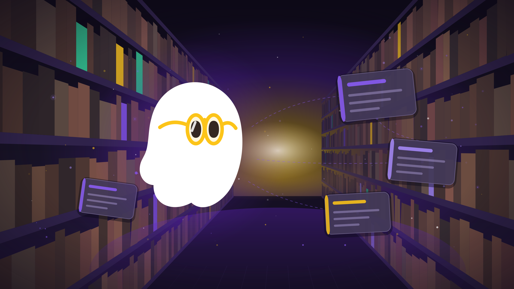
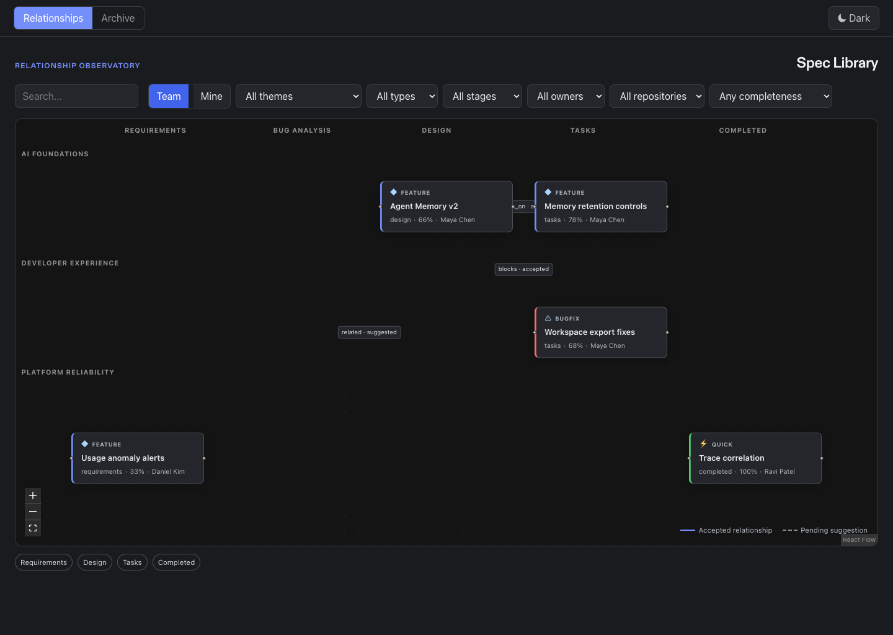
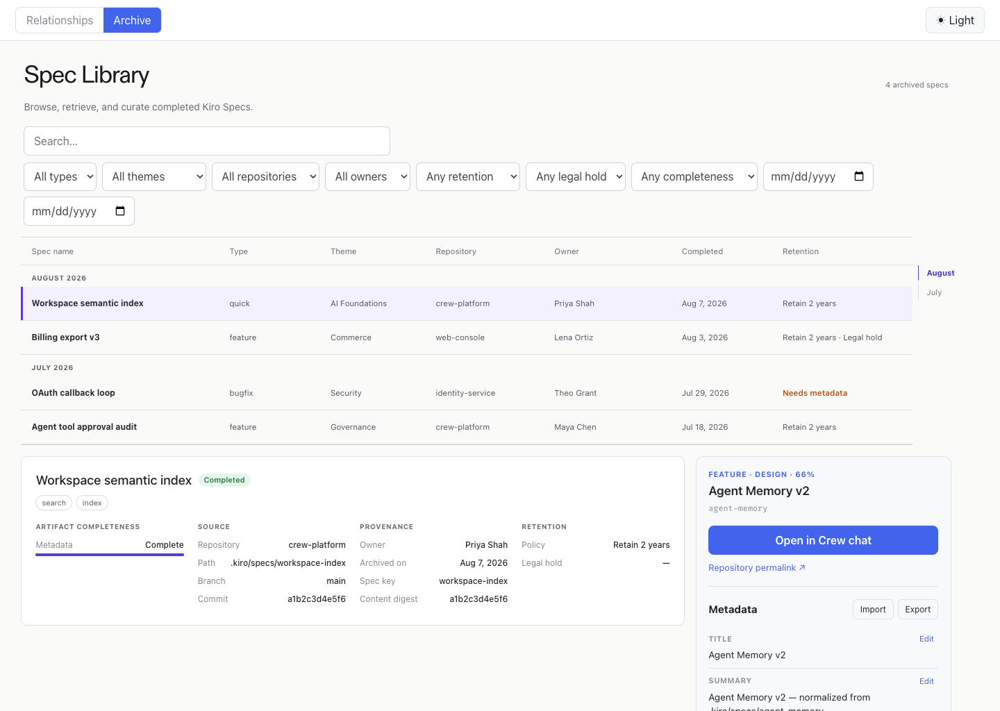

<p align="center">
  
</p>

<h1 align="center">Spectral Library for Kiro Crew</h1> 

<p align="center">
  <strong>Index, browse, and curate Kiro Specs across repositories with relationship mapping and AI-assisted metadata.</strong>
</p>

<p align="center">
  
  
  
  
  
  
</p>

---

<p align="center">
  
</p>

A [Kiro Crew](https://kiro.dev/docs/crew/apps/) app that discovers `.kiro/specs/` artifacts from local and remote Git repositories, normalizes them into a browsable catalog, visualizes relationships on a dark graph canvas, archives completed specs as immutable snapshots, and provides an AI agent for metadata curation.

## Screenshots

| Relationship View (dark) | Archive View (light) |
|:---:|:---:|
|  |  |

## Features

- **Relationship graph canvas** — dark graphite surface with stage columns, theme lanes, and deterministic node placement. Solid edges for curated relationships, dashed for AI suggestions.
- **Chronological archive** — light table of immutable snapshots grouped by completion month with SHA-256 hash verification, retention policies, and legal holds.
- **Multi-source scanning** — index specs from local directories and remote Git repos (HTTPS/SSH). Single-flight scans every 15 minutes with graceful degradation.
- **AI-powered suggestions** — TF-IDF cosine similarity, shared tags, markdown link detection, and repository proximity generate up to 5 relationship suggestions per spec.
- **Spec Librarian agent** — restricted MCP agent that searches specs, retrieves context, and submits metadata proposals (never modifies accepted state directly).
- **Full-text search** — FTS5 across titles, content, owners, themes, tags, and repositories with BM25 ranking.
- **Metadata curation** — overlay priority (user > sidecar > artifact-derived), optimistic concurrency, and completeness tracking.
- **Keyboard accessible** — roving focus, arrow navigation, Enter selection, 3:1 contrast focus states, and non-color status indicators.

## Architecture

```
┌─────────────────────────────────────────────────────────┐
│                    Crew Platform Shell                  │
├──────────────┬──────────────────────┬───────────────────┤
│   UI (ESM)   │   Backend (Elysia)   │   MCP Server      │
│   React +    │   bun:sqlite WAL     │   4 tools         │
│   @xyflow    │   FTS5 search        │   Token-protected │
│   TypeBox    │   21 REST endpoints  │   64 KB cap       │
└──────────────┴──────────────────────┴───────────────────┘
       │                   │                    │
       │         ┌─────────┴─────────┐          │
       │         │   SQLite + FTS5   │          │
       │         └─────────┬─────────┘          │
       │                   │                    │
       └───────────────────┼────────────────────┘
                           │
              ┌────────────┴────────────┐
              │  Git Repos (local/SSH)  │
              └─────────────────────────┘
```

### Workspaces

| Workspace | Purpose | Key Dependencies |
|-----------|---------|-----------------|
| `shared/` | Types, constants, Zod schemas, credential redactor | `zod` |
| `backend/` | Elysia HTTP server, SQLite, scanner, services | `elysia`, `bun:sqlite` |
| `ui/` | React components, graph canvas, views | `@xyflow/react`, `lucide-react` |
| `mcp/` | MCP protocol server, tool implementations | `@modelcontextprotocol/sdk` |

## Prerequisites

- [Kiro Crew](https://kiro.dev/docs/crew/) ≥ 0.2.0
- [Bun](https://bun.sh) ≥ 1.1
- [Git](https://git-scm.com) ≥ 2.30
- macOS (arm64/x64) or Linux (x64)

## Installation

### From the Kiro App Store

Search for **Spec Library** in the Crew App Store and click Install.

### From source

```bash
git clone https://github.com/jhu-sheridan-libraries/kiro-spec-library.git
cd kiro-spec-library
bun install

# Install into your local Crew instance
kirocrew app install --path .
```

## Development

```bash
# Install dependencies
bun install

# Start the backend (auto-port, SQLite in ./data/)
bun run dev

# Build all workspaces
bun run build

# Type-check
bun run typecheck

# Run tests
bun test                    # Unit + property-based
bun test tests/integration  # Integration tests
bunx playwright test        # E2E tests

# Lint
bun run lint
```

### UI Preview

The UI workspace includes a standalone preview for development without Crew:

```bash
cd ui
open preview.html
```

## Configuration

Once installed, configure sources through the Crew dashboard or API:

```bash
# Add a local repository source
curl -X PUT http://localhost:$PORT/apps/kiro-spec-library/api/v1/settings/sources \
  -H 'Content-Type: application/json' \
  -d '[{"type":"local","path":"/path/to/your/repo"}]'

# Add a remote repository source
curl -X PUT http://localhost:$PORT/apps/kiro-spec-library/api/v1/settings/sources \
  -H 'Content-Type: application/json' \
  -d '[{"type":"remote","url":"git@github.com:org/repo.git","branch":"main"}]'
```

The app uses the host's SSH agent or Git credential helper — it never collects or stores credentials.

## The Spectral Librarian

The bundled AI agent (👻📚) can:

- **Search** specs by title, content, owner, theme, or tags
- **Retrieve** full spec context with artifact content
- **Propose** metadata changes (title, tags, relationships) as pending proposals

All agent actions produce proposals that require explicit user acceptance. Launch it from the metadata panel or via `useChatLauncher` in the Crew shell.

## REST API

All endpoints live under `/apps/kiro-spec-library/api/v1`:

| Endpoint | Description |
|----------|-------------|
| `GET /health` | Readiness probe (200/503) |
| `GET /specs` | Paginated catalog with filters |
| `GET /specs/:id` | Spec detail with resolved metadata |
| `PATCH /specs/:id/metadata` | Update metadata (revision-checked) |
| `POST /specs/:id/relationships` | Create typed relationship |
| `GET /archive` | Cursor-paginated snapshots |
| `POST /sync` | Trigger manual scan |

See the [design document](.kiro/specs/spec-library-crew-app/design.md) for the full 21-endpoint specification.

## Project Structure

```
kiro-spec-library/
├── app.json              # Crew app manifest
├── package.json          # Bun workspace root
├── shared/src/           # Types, schemas, constants
├── backend/src/          # Elysia server + SQLite
│   ├── db/               # Migrations, queries
│   ├── services/         # Scanner, normalizer, suggester, archiver
│   ├── security/         # Path/Git validators
│   └── routes/           # REST endpoint handlers
├── ui/src/               # React UI
│   ├── views/            # RelationshipView, ArchiveView
│   ├── components/       # Graph, panels, filters
│   └── hooks/            # Crew integration, URL state
├── mcp/src/              # MCP server + tools
├── agents/               # Spectral Librarian definition
├── tests/                # Unit, property, integration, e2e
├── docs/                 # ADRs, initial plan, assets
└── poc/                  # Original React prototype (reference)
```

## Security

- **No repository writes** — the app never modifies, commits to, or pushes source repositories
- **Path traversal prevention** — rejects `..`, symlink escapes, filesystem root, credential paths
- **Git injection prevention** — blocks shell metacharacters and dangerous options (`--upload-pack`, `--exec`)
- **Credential redaction** — 7 regex patterns strip secrets before UI/MCP exposure
- **MCP boundary** — agent proposals are pending-only; never modify accepted state directly
- **Purge ceremony** — requires retention expiry + no holds + exact `PURGE <id>` confirmation

## Testing

| Layer | Framework | Coverage |
|-------|-----------|----------|
| Unit | Bun test | Normalizer, security, archiver, suggester, MCP |
| Property-based | fast-check | 18 correctness properties (100+ iterations each) |
| Integration | Bun test | Scanner + Git repos, API CRUD, MCP tools, migrations |
| E2E | Playwright | Keyboard nav, filters, visual regression |

Key correctness properties validated:
- Normalizer determinism (identical inputs → identical outputs)
- Sidecar round-trip equivalence (export → import → export = identity)
- TF-IDF similarity bounds ([0,1], self-similarity = 1.0)
- Path traversal rejection (any `..` always rejected)
- Purge confirmation exactness (only exact text accepted)

## Contributing

1. Fork the repository
2. Create a feature branch (`git checkout -b feat/your-feature`)
3. Write tests for new functionality
4. Ensure `bun test` and `bun run typecheck` pass
5. Submit a PR with a clear description

### Changelog

This project uses [changelog fragments](changes/README.md). Add a `changes/<name>.<type>.md` file with your PR. Run `bun run changelog:compile` to generate the CHANGELOG before a release.

## License

[Apache-2.0](LICENSE) — Johns Hopkins University Sheridan Libraries

---

<p align="center">
  
</p>

<p align="center">
  <sub>Built with <a href="https://kiro.dev">Kiro</a> · Powered by <a href="https://bun.sh">Bun</a> · Graphed by <a href="https://reactflow.dev">React Flow</a></sub>
</p>
